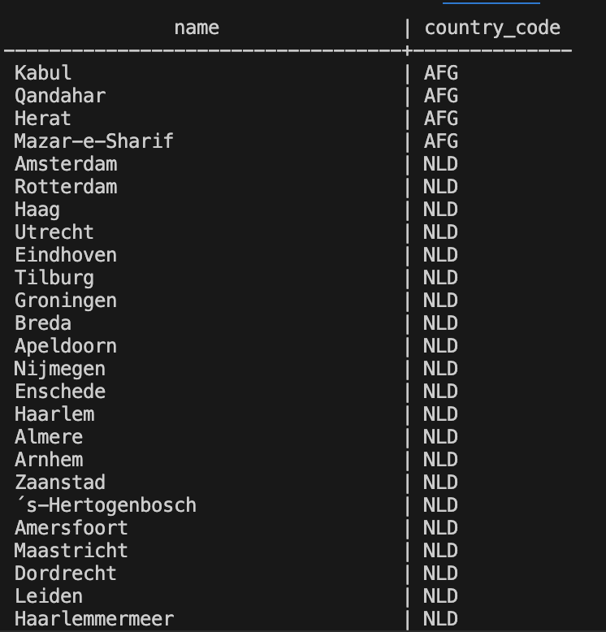

# Exercise 01: World Database SQL Practice

- Name: Kevin Hennelly
- Course: Database for Analytics
- Module: 1
- Database Used: World Database

---

## Instructions

- Answer each question below.
- All SQL commands **must be executed** against the World database.
- For each SQL command:
  - Include the SQL in a fenced code block
  - Include a **screenshot** showing the command and results
- Store screenshots in the `screenshots/` folder and embed them below each answer.

---

## Question 1

**Compare and contrast the data types used for:**
- `country.Population`
- `country.LifeExpectancy`

Why were these data types selected?

### Answer
`country.Population` is stored as an integer data type since population values represent whole-number counts of people and do not require fractional precision.

`country.LifeExpectancy` is stored as a decimal data type because life expectancy represents an average value that may include fractional years (for example, 72.6 years).

These types were selected to accurately represent the nature of the data while maintaining proper precision and efficient storage

### Screenshot
_Show the table structure or DESCRIBE output._

```sql
DESCRIBE country;
```

)

---

## Question 2

**What is the data type of `country.IndepYear`?**
Why do you think this data type was selected?

### Answer
The data type of `country.IndepYear` is `smallint`.

Selected because independence years are four-digit calendar years
that fall well within the numeric range supported by `SMALLINT`. Using `SMALLINT`
requires less storage than `INT` but still accurately represents historical
year values, and it allows `NULL` values for countries that do not have an
independence year.

### Screenshot

```sql
DESCRIBE country;
```

)

---

## Question 3

**Make a case for a different data type for `country.IndepYear`.**
Explain why your proposed data type might be better in some situations.

### Answer
An alternative data type for `country.IndepYear` could be `YEAR`.

Using the `YEAR` data type is useful when the column represents solely a calendar
year. It provides clearer meaning, improves readability, and enforces valid year values at the database level. In systems that perform frequent date-based calculations or comparisons, `YEAR` can also simplify queries and reduce the likelihood of invalid or inconsistent data.

---

## Question 4

Write a SQL command to **list the names of all cities in alphabetical order**.

### SQL

```sql
SELECT Name
FROM city
ORDER BY Name;
```

### Screenshot

)

---

## Question 5

Write a SQL command to **list all forms of government from the `country` table**, showing **each only once**, sorted alphabetically.

### SQL

```sql
SELECT DISTINCT GovernmentForm
FROM country
ORDER BY GovernmentForm;
```

### Screenshot

)

---

## Question 6

Write a SQL command to **list all countries in the `Oceania` continent**.

### SQL

```sql
SELECT Name
FROM country
WHERE Continent = 'Oceania';
```

### Screenshot

)

---

## Question 7

Write a SQL command to **list the names and country code of all cities**.

### SQL

```sql
SELECT name, country_code
FROM city;
```

### Screenshot



---

## Question 8

Write a SQL command to **update the city named `"Nashville-Davidson"` to `"Nashville"`**.

### SQL

```sql
UPDATE city
SET Name = 'Nashville'
WHERE Name = 'Nashville-Davidson';
```

### Screenshot

)

---

## Question 9

Write a SQL command to **insert a new country named `"Narnia"`** with a country code of `"NAR"`.
Use reasonable values for the remaining columns.

### SQL

```sql
INSERT INTO country (Code, Name, Continent, Region, Population)
VALUES ('NAR', 'Narnia', 'Europe', 'Fantasy', 1000000);
```

### Screenshot

)

---

## Question 10

Write a SQL command to **delete the country with the country code `"NAR"`**.

### SQL

```sql
DELETE FROM country
WHERE Code = 'NAR';
```

### Screenshot

)
