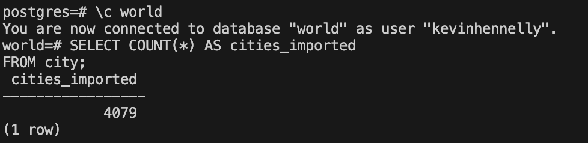
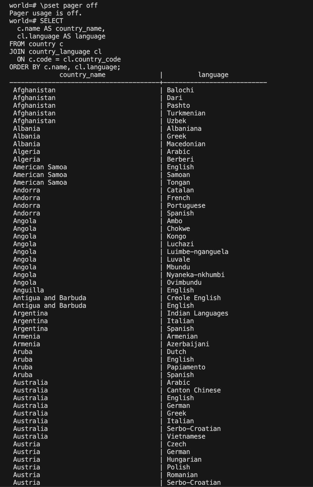
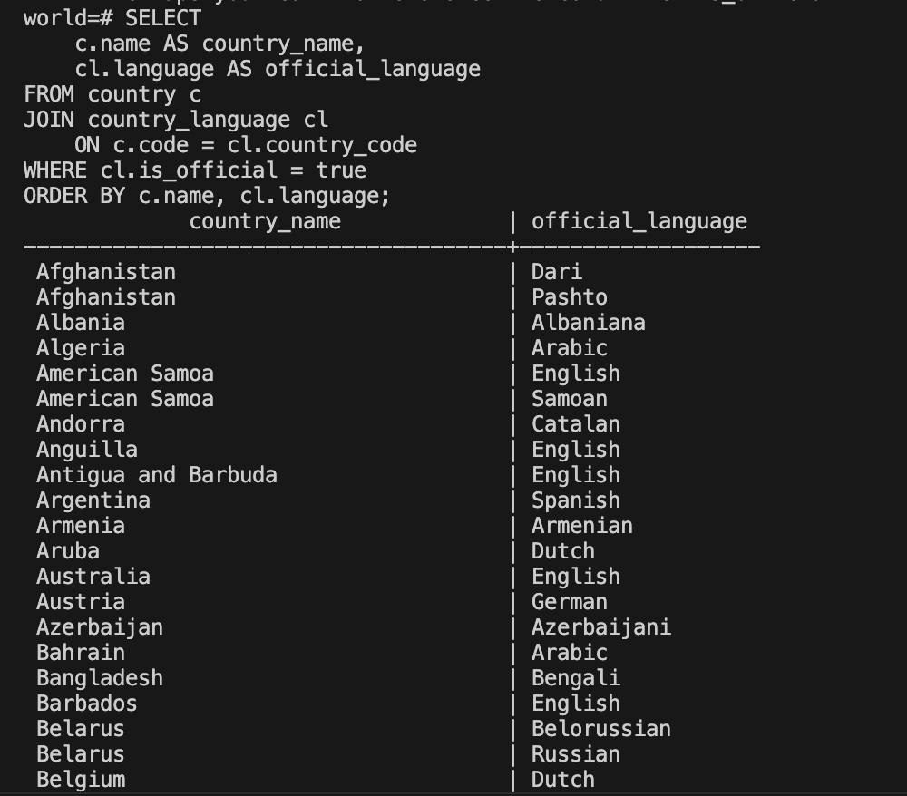
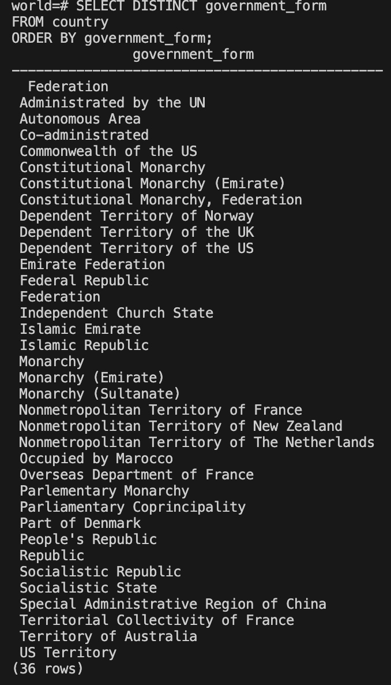
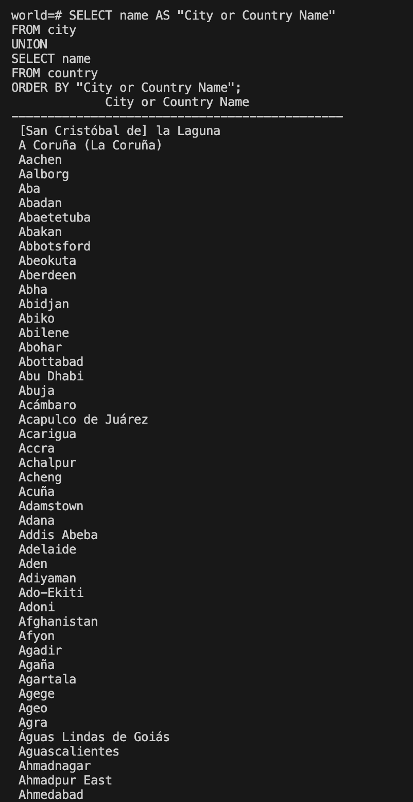
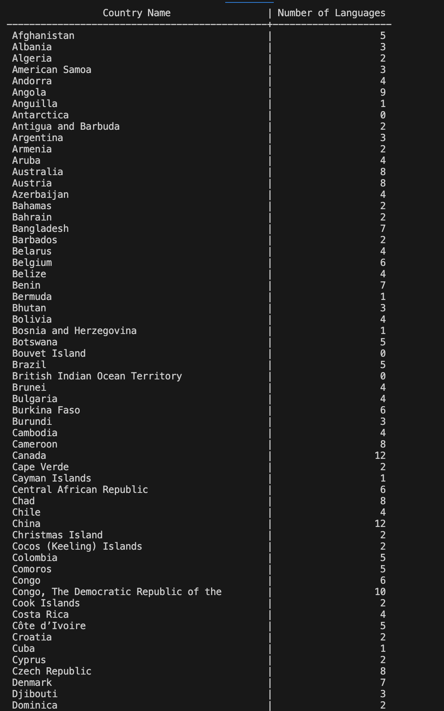
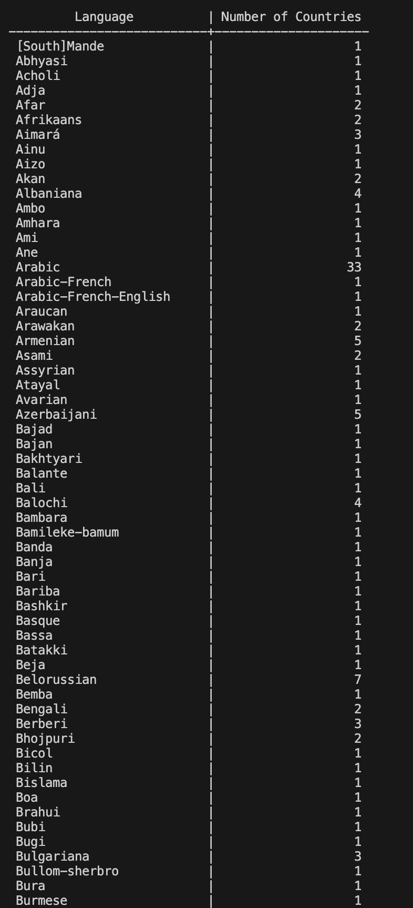
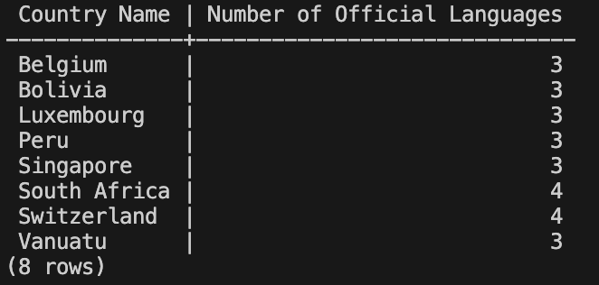
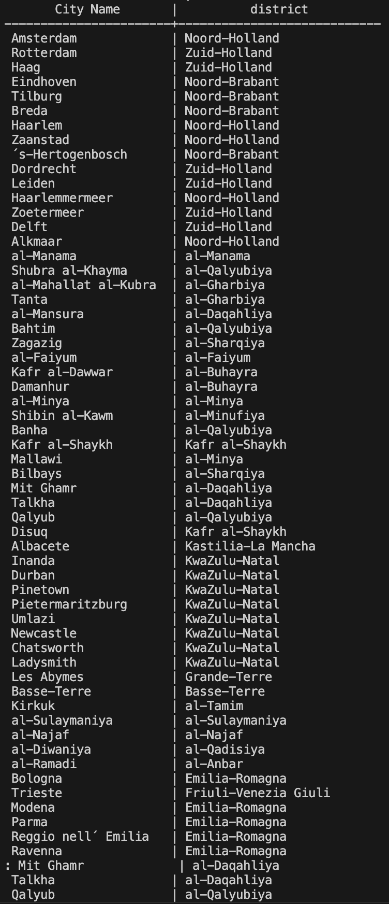
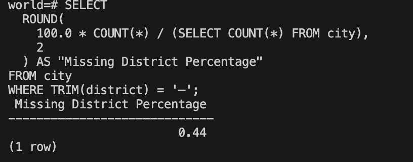

# Exercise 02: World Database – Joins, Grouping, and Data Quality

- Name: Kevin Hennelly
- Course: Database for Analytics
- Module: 2
- Database Used: World Database (PostgreSQL)

---

## Instructions

- Answer each question below using SQL executed against the **World database**.
- All SQL commands **must be run by you**.
- For each SQL-based question:
  - Include the SQL command in a fenced code block
  - Include a **screenshot** showing the command and its results
- Store screenshots in the `screenshots/` folder and embed them below each answer.

---

## Question 1

When importing records from `worldPGSQL.sql`, **how many cities were imported**?

### Answer
4079

### Screenshot


```sql
SELECT COUNT(*) AS cities_imported
FROM city;
 cities_imported 
```


---

## Question 2

Using the World database, write the SQL command to **display each country name along with the name of each language spoken in that country**.

### SQL

```sql
SELECT
  c.name AS country_name,
  cl.language AS language
FROM country c
JOIN country_language cl
  ON c.code = cl.country_code
ORDER BY c.name, cl.language;
```

### Screenshot



---

## Question 3

Using the World database, write the SQL command to **display each country name along with the name of each official language spoken in that country**.

### SQL

```sql
SELECT
    c.name AS country_name,
    cl.language AS official_language
FROM country c
JOIN country_language cl
    ON c.code = cl.country_code
WHERE cl.is_official = true
ORDER BY c.name, cl.language;
```

### Screenshot



---

## Question 4

Consider the following two SQL statements:

```sql
SELECT *
FROM country, countrylanguage
WHERE country.code = countrylanguage.countrycode;
```

```sql
SELECT *
FROM country
LEFT OUTER JOIN countrylanguage
ON country.code = countrylanguage.countrycode;
```

**In your own words**, describe what data the **second query returns that the first query does not**.

### Answer

The second query includes every country even those that do not have a matching language record, in which case the countrylanguage column comes back as NULL.  This differs from the first query which leaves those countries out completely.

---

## Question 5

Using the World database, write the SQL command to **list all different forms of government** found in the data.
Do **not** repeat any form of government more than once.

### SQL

```sql
SELECT DISTINCT government_form
FROM country
ORDER BY government_form;
```

### Screenshot



---

## Question 6

Using the World database, write the SQL command to **list all names of cities and countries in one column**.
Label the column **"City or Country Name"**.

### SQL

```sql
SELECT name AS "City or Country Name"
FROM city
UNION
SELECT name
FROM country
ORDER BY "City or Country Name";
```

### Screenshot



---

## Question 7

Using the World database, write the SQL command to **list all countries by name**, along with the **number of languages spoken in each country**.
Be sure to **sort by country name**.

### SQL

```sql
SELECT
  c.name AS "Country Name",
  COUNT(cl.language) AS "Number of Languages"
FROM country c
LEFT JOIN country_language cl
  ON cl.country_code = c.code
GROUP BY c.name
ORDER BY c.name;


```

### Screenshot



---

## Question 8

Using the World database, write the SQL command to **list all languages**, along with the **number of countries where each language is spoken**.
Be sure to **sort by language name**.

### SQL

```sql
SELECT
  language AS "Language",
  COUNT(country_code) AS "Number of Countries"
FROM country_language
GROUP BY language
ORDER BY language;
```

### Screenshot



---

## Question 9

Using the World database, write the SQL command to **list countries that have more than two official languages**, along with the **number of official languages spoken**.

*Hint: There are 8 such countries in this dataset.*

### SQL

```sql
SELECT
  c.name AS "Country Name",
  COUNT(cl.language) AS "Number of Official Languages"
FROM country c
JOIN country_language cl
  ON cl.country_code = c.code
WHERE cl.is_official = 'T'
GROUP BY c.name
HAVING COUNT(cl.language) > 2
ORDER BY c.name;
```

### Screenshot



---

## Question 10

Using the World database, write the SQL command to **find cities where the district value is missing**.

*Hint: Use `LIKE` and the dash (`-`) since some rows use that instead of actual data.*

### SQL

```sql
SELECT
  name AS "City Name",
  district
FROM city
WHERE district LIKE '%-%';
```

### Screenshot



---

## Question 11

Using the World database, write the SQL command to **calculate the percentage of cities with missing district values**.

*Hint: The result should be approximately 0.4%.*

### SQL

```sql
SELECT
  ROUND(
    100.0 * COUNT(*) / (SELECT COUNT(*) FROM city),
    2
  ) AS "Missing District Percentage"
FROM city
WHERE TRIM(district) = '–';
```

### Screenshot


